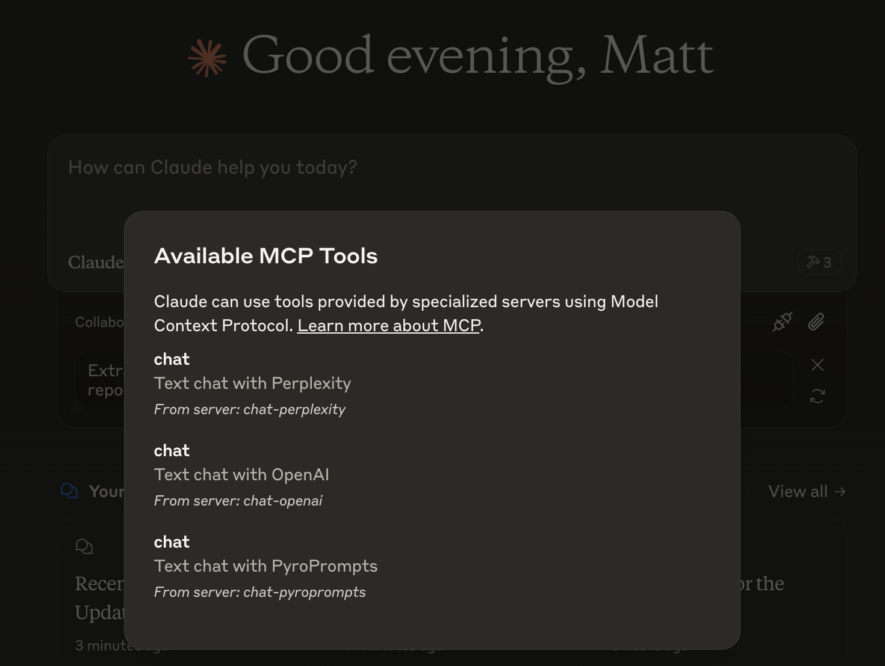
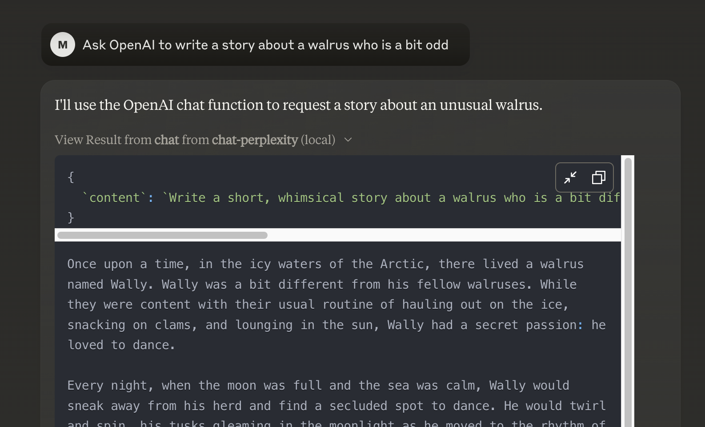

# any-chat-completions-mcp MCP Server

Integrate Claude with Any OpenAI SDK Compatible Chat Completion API - OpenAI, Perplexity, Groq, xAI, PyroPrompts and more.

## Supported Providers & Models

Here are some popular providers and their recommended models. Note that model availability may change - check your provider's documentation for the latest information.

### OpenAI
- `gpt-4-turbo-preview` - Latest GPT-4 model
- `gpt-4o-mini` - Smaller GPT-4 model
- `gpt-3.5-turbo` - GPT-3.5 model
- See [OpenAI Models Documentation](https://platform.openai.com/docs/models) for full list

### Perplexity
- `llama-3.1-sonar-small-128k-online`
- `mixtral-8x7b-instruct`
- See [Perplexity Documentation](https://docs.perplexity.ai) for more models

### PyroPrompts
- `ash` - Fast response model
- `ember` - Balanced model
- `inferno` - Most capable model
- See [PyroPrompts Documentation](https://pyroprompts.com/docs) for latest models

This implements the Model Context Protocol Server. Learn more: [https://modelcontextprotocol.io](https://modelcontextprotocol.io)

This is a TypeScript-based MCP server that implements an implementation into any OpenAI SDK Compatible Chat Completions API.

It has one tool, `chat` which relays a question to a configured AI Chat Provider.


## Development

Install dependencies:
```bash
npm install
```

Build the server:
```bash
npm run build
```

For development with auto-rebuild:
```bash
npm run watch
```

## Installation & Configuration

### API Key Setup
1. Obtain an API key from your chosen provider
2. Set the key in the configuration file as shown below
3. Verify your account has access to the desired models
4. Check quota limits and pricing on your provider's dashboard

### Server Configuration

To add a chat provider to Claude Desktop, add the server config:

On MacOS: `~/Library/Application Support/Claude/claude_desktop_config.json`
On Windows: `%APPDATA%/Claude/claude_desktop_config.json`


```json

{
  "mcpServers": {
    "chat-openai": {
      "command": "node",
      "args": [
        "/path/to/any-chat-completions-mcp/build/index.js"
      ],
      "env": {
        "AI_CHAT_KEY": "OPENAI_KEY",
        "AI_CHAT_NAME": "OpenAI",
        "AI_CHAT_MODEL": "gpt-4o",
        "AI_CHAT_BASE_URL": "https://api.openai.com/v1"
      }
    }
  }
}
```

You can add multiple providers by referencing the same MCP server multiple times, but with different env arguments:

```json

{
  "mcpServers": {
    "chat-pyroprompts": {
      "command": "node",
      "args": [
        "/path/to/any-chat-completions-mcp/build/index.js"
      ],
      "env": {
        "AI_CHAT_KEY": "PYROPROMPTS_KEY",
        "AI_CHAT_NAME": "PyroPrompts",
        "AI_CHAT_MODEL": "ash",
        "AI_CHAT_BASE_URL": "https://api.pyroprompts.com/openaiv1"
      }
    },
    "chat-perplexity": {
      "command": "node",
      "args": [
        "/path/to/any-chat-completions-mcp/build/index.js"
      ],
      "env": {
        "AI_CHAT_KEY": "PERPLEXITY_KEY",
        "AI_CHAT_NAME": "Perplexity",
        "AI_CHAT_MODEL": "llama-3.1-sonar-small-128k-online",
        "AI_CHAT_BASE_URL": "https://api.perplexity.ai"
      }
    },
    "chat-openai": {
      "command": "node",
      "args": [
        "/path/to/any-chat-completions-mcp/build/index.js"
      ],
      "env": {
        "AI_CHAT_KEY": "OPENAI_KEY",
        "AI_CHAT_NAME": "OpenAI",
        "AI_CHAT_MODEL": "gpt-4o",
        "AI_CHAT_BASE_URL": "https://api.openai.com/v1"
      }
    }
  }
}
```

With these three, you'll see a tool for each in the Claude Desktop Home:



And then you can chat with other LLMs and it shows in chat like this:



### Troubleshooting

#### Common Error Codes
- **404 Model Not Found**: Verify the model name is correct and your account has access to it
- **429 Rate Limit**: You've exceeded your API quota. Check your usage limits and billing status
- **401 Unauthorized**: Check your API key is correct and has proper permissions
- **500/502/503**: Provider API issues - retry later

#### Debugging

Since MCP servers communicate over stdio, debugging can be challenging. We recommend using the [MCP Inspector](https://github.com/modelcontextprotocol/inspector), which is available as a package script:

```bash
npm run inspector
```

The Inspector will provide a URL to access debugging tools in your browser.

### Best Practices

1. **Model Selection**:
   - Start with smaller/cheaper models for testing
   - Use multiple configurations for different models if needed
   - Consider latency vs capability tradeoffs

2. **Error Handling**:
   - Monitor your API usage and quotas
   - Have fallback providers configured if needed
   - Check provider status pages for service issues

3. **Configuration Tips**:
   - Keep API keys secure and rotate regularly
   - Test configurations before deploying
   - Monitor costs and usage patterns

### Acknowledgements

- Obviously the modelcontextprotocol and Anthropic team for the MCP Specification and integration into Claude Desktop. [https://modelcontextprotocol.io/introduction](https://modelcontextprotocol.io/introduction)
- [PyroPrompts](https://pyroprompts.com?ref=github-any-chat-completions-mcp) for sponsoring this project. Use code `CLAUDEANYCHAT` for 20 free automation credits on Pyroprompts.
